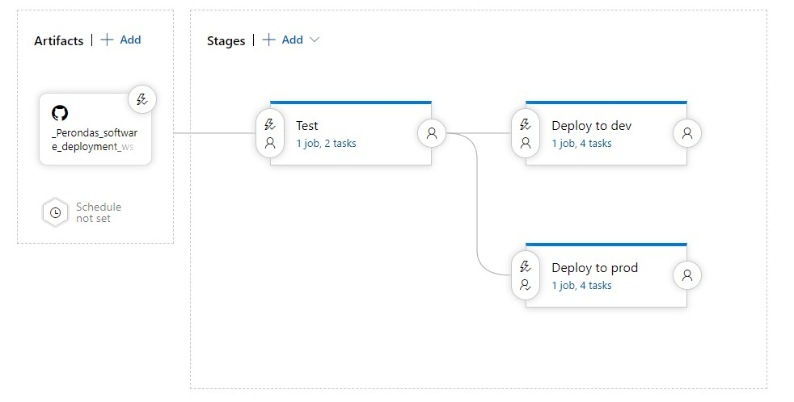
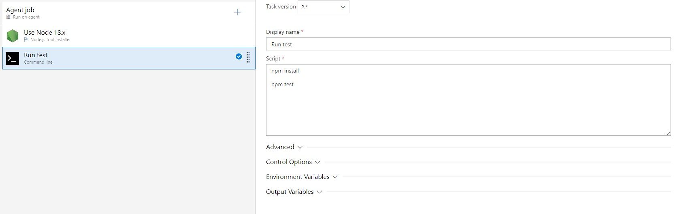
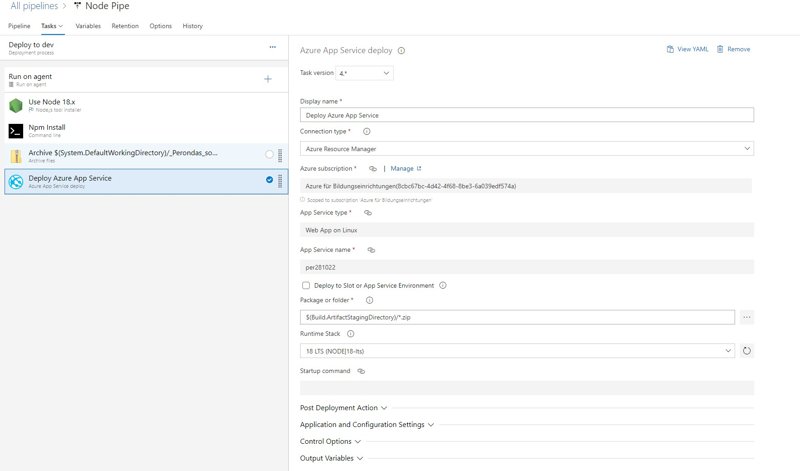
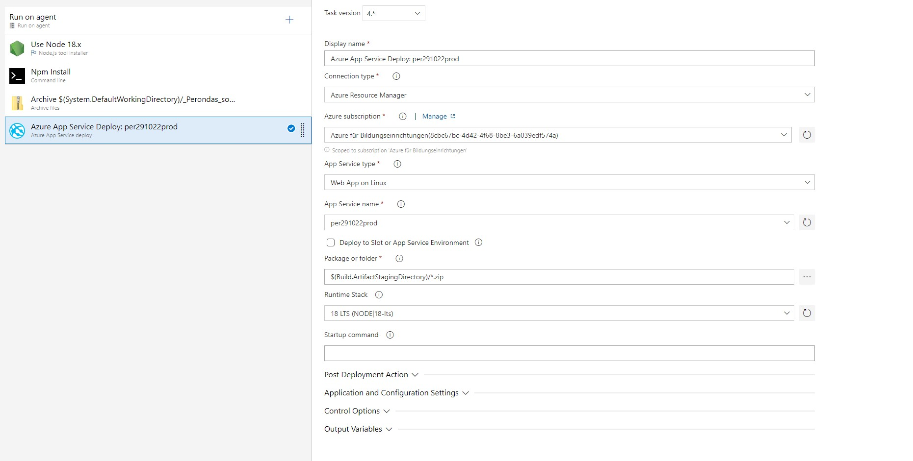

# Lab 2

[Release site](https://per291022prod.azurewebsites.net/)
[Dev site](https://per281022.azurewebsites.net)

## Screenshots
### The pipeline

### The test pipeline

### The dev release pipeline

### The prod release pipeline

## Release documentation

And push to this repo will result in a new release to the dev site. The release pipeline is triggered by a new commit to the master branch. The release pipeline will run the tests and if they pass, deploy the app to the dev site.
The commit will only be deployed to the production site if all tests are passed and the go ahead is given in the release pipeline.