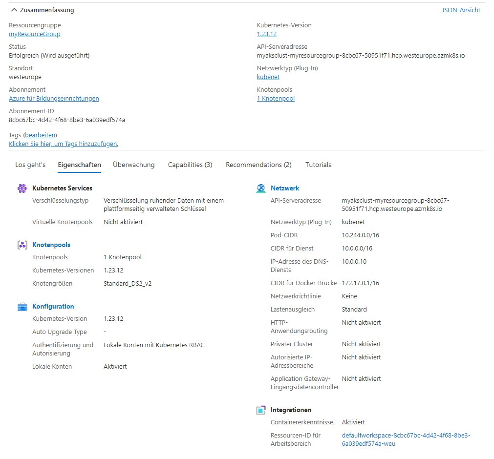

# Instructions

Run:
```console
az group create --name myResourceGroup --location westeurope

az aks create -g myResourceGroup -n myAKSCluster --enable-managed-identity --node-count 2 --enable-addons monitoring --enable-msi-auth-for-monitoring  --generate-ssh-keys

kubectl apply -f .\azure-wp.yaml 
```

This will deploy the DB and web server.

# Screenshot
Cluster url: myaksclust-myresourcegroup-8cbc67-50951f71.hcp.westeurope.azmk8s.io



# File description
azure-wp.yaml: This file contains the deployment of the DB and web server.